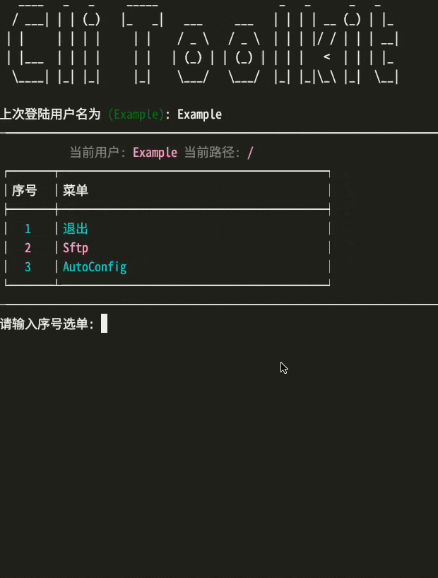

# CliTookKit



本仓库在 [Spectre.Console](https://spectreconsole.net/widgets/table) 交互式命令行的基础上做的扩展，目前对 Sftp 上传协议做了相对完善的交互支持，理论上你可以在这个库的基础上做很多自己项目需要用到的小工具

> 如果有运行问题，需要检查自己电脑是否安装了 dotnet6，第一次运行时，会自动下载 Nuget 包

## 运行方式

- 菜单交互
- Cli 直接运行

```shell
# 运行菜单交互
dotnet run

# 运行 Cli
dotnet run -- Cli

# 指定运行上传 YooAsset
dotnet run -- Cli -u Example -p Sftp/YooAsset --yooasset_local_dir 路径 --yooasset_remote_dir 路径
```

## 参数配置

这里的参数指两种

- 命令行透传参数，如上面例子中 `-u`、`-p` 等
    - 目前定义的透传参数放在 `Settings.cs` 文件中
- 账户保存参数，如 sftp 账号
    - 需要动态保存的参数，都存放在 `.AutoConfig/` 文件中，运行时自动创建

在第一次运行时，会提示创建账号，此账号用于区分不同账号下的不同配置

> 比如我有 A 渠道的 Sftp 服务器，和 B 渠道的 Sftp 服务器，两个渠道服务器的账号密码都不一样，这里区分账号就是为了解决这类场景

如果当前用户的 Sftp 配置已经保存了。那么在下次运行 Sftp 相关代码时，就不会提示输入账号密码等信息，其他配置也是同理

### 缺省参数

这里的运行结果，是已经保存过 `Example` 对应的 Sftp 账号密码等信息

```shell
# 运行交互菜单
dotnet run 

# 提示填写用户名，并提示选择运行菜单（支持多个菜单复选）
dotnet run -- Cli

# 提示选择运行菜单（支持多个菜单复选）
dotnet run -- Cli -u Example

# 要求填写 本地路径 和 远端路径
dotnet run -- Cli -u Example -p Sftp/YooAsset

# 要求填写 远端路径
dotnet run -- Cli -u Example -p Sftp/YooAsset --yooasset_local_dir 路径

# 无任何交互，直接运行
dotnet run -- Cli -u Example -p Sftp/YooAsset --yooasset_local_dir 路径 --yooasset_remote_dir 路径
```

## 自定义菜单

我们以 `Sftp/YooAsset` 菜单来举例，当用户第一次进入 `Sftp` 菜单时，我们希望检查一下当前用户是否已经配置了 Sftp 账号，如果没有，则提示创建

```csharp
[MenuEnter("Sftp")]
public class SftpEnter : AMenuEnter
{
    protected override Task _WhenEnter(CancellationToken token)
    {
        AnsiConsole.WriteLine("检查 Sftp 配置文件...");
        // 当第一次进入 Sftp 菜单时, 会检查当前 Sftp 是否已经正确配置
        AutoConfigUtils.GetAutoConfig<SftpAutoConfig>();
        AutoConfigUtils.GetAutoConfig<SftpIgnoreAutoConfig>();

        return Task.CompletedTask;
    }
}
```

这里的 `AMenuEnter` 配合 `MenuEnterAttibute` 就完成了标记，剩下的只需要在 `_WhenEnter` 中填充即可, 而 `Sftp/YooAsset` 真正执行的代码和 Enter 不同

```csharp
[Menu("Sftp/YooAsset")]
public class SftpYooAsset : AMenuExecute
{
    protected override Task _Execute(CancellationToken token)
    {
        var local_dir  = Settings.Current.yooasset_local_dir;
        var remote_dir = Settings.Current.yooasset_remote_dir;

        if(string.IsNullOrEmpty(local_dir))
        {
            local_dir = AnsiConsole.Prompt(new TextPrompt<string>("请输入本地文件夹路径: ").Validate(Directory.Exists));
        }

        if(string.IsNullOrEmpty(remote_dir))
        {
            remote_dir = AnsiConsole.Prompt(new TextPrompt<string>("请输入远端文件夹路径"));
        }

        return SftpUtils.DiffUploadWithProgress(local_dir, remote_dir);
    }
}
```

这里需要使用 `AMenuExecute` 和 `MenuAttribute`

## 自定义配置

这里要用到 `IAutoConfig` 和 `AutoConfigAttribute`

```csharp
[Serializable]
[AutoConfig(false)]
public class SftpIgnoreAutoConfig : IAutoConfig
{
    public bool CheckPrompt()
    {
        // 检查合法性，并根据是否合法进行返回
    }
}
```

所有 `IAutoConfig` 都可以通过 `AutoConfig/*` 相关菜单进行手动配置